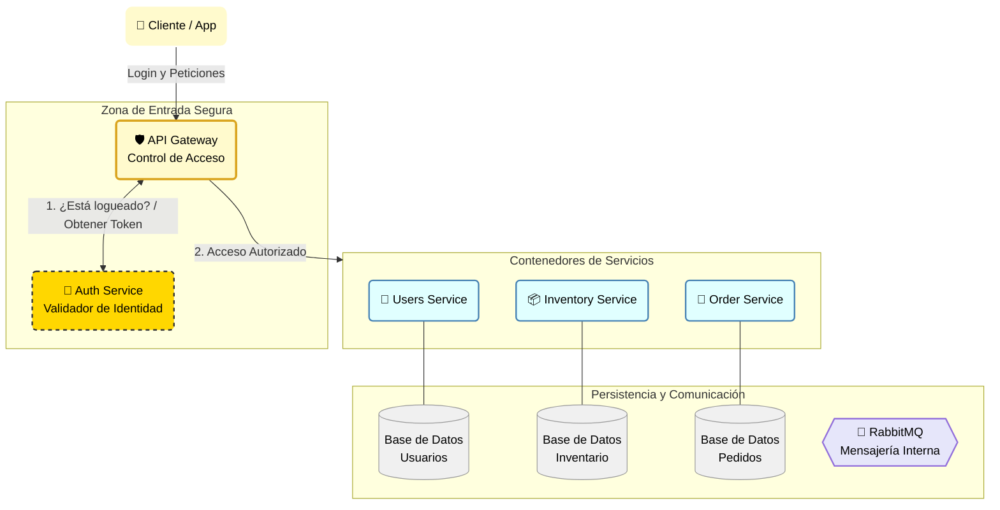

```mermaid
graph TD
    %% --- ESTILOS VISUALES (Colores y formas) ---
    classDef cliente fill:#FFFACD,stroke:#fff,stroke-width:2px,rx:10,ry:10,color:#000;
    classDef gateway fill:#FFFACD,stroke:#DAA520,stroke-width:3px,rx:5,ry:5,color:#000;
    classDef auth fill:#FFD700,stroke:#333,stroke-width:2px,stroke-dasharray: 5 5,color:#000;
    classDef servicio fill:#E0FFFF,stroke:#4682B4,stroke-width:2px,color:#000;
    classDef db fill:#F0F0F0,stroke:#999,stroke-width:1px,color:#000;
    classDef msg fill:#E6E6FA,stroke:#9370DB,stroke-width:2px,color:#000;


    %% --- CAPA DE NEGOCIO (Microservicios) ---
    subgraph Negocio [Contenedores de Servicios]
        direction LR
        UserService(👥 Users Service):::servicio
        InvService(📦 Inventory Service):::servicio
        OrderService(🛒 Order Service):::servicio
    end

    %% El Gateway distribuye el tráfico YA validado
    GW -->|2. Acceso Autorizado| Negocio
    %%GW -->|2. Acceso Autorizado| InvService
    %%GW -->|2. Acceso Autorizado| OrderService

    %% ---  CAPA DE DATOS Y MENSAJERIA ---
    subgraph Datos [Persistencia y Comunicación]
        DB_Users[(Base de Datos<br/>Usuarios)]:::db
        DB_Inv[(Base de Datos<br/>Inventario)]:::db
        DB_Order[(Base de Datos<br/>Pedidos)]:::db
        Rabbit{{🐰 RabbitMQ<br/>Mensajería Interna}}:::msg
    end


    %% --- CAPA DE CLIENTE ---
    User(👤 Cliente / App):::cliente

    %% --- CAPA DE ENTRADA Y SEGURIDAD ---
    subgraph Entrada [Zona de Entrada Segura]
        direction TB
        GW(🛡️ API Gateway<br/>Control de Acceso):::gateway
        AuthService(🔐 Auth Service<br/>Validador de Identidad):::auth
    end

    %% Conexión Cliente -> Gateway
    User -->|Login y Peticiones| GW

    %% Interacción Gateway <-> Auth (El loop de seguridad)
    GW <-->|1. ¿Está logueado? / Obtener Token| AuthService

    %% Conexiones a BD
    UserService --- DB_Users
    InvService --- DB_Inv
    OrderService --- DB_Order

    %% Comunicación Asíncrona (Inventario <-> Pedidos)
    %% InvService -.- |Sincronización Stock| Rabbit
    %% Rabbit -.- |Procesar Pedido| OrderService
```
