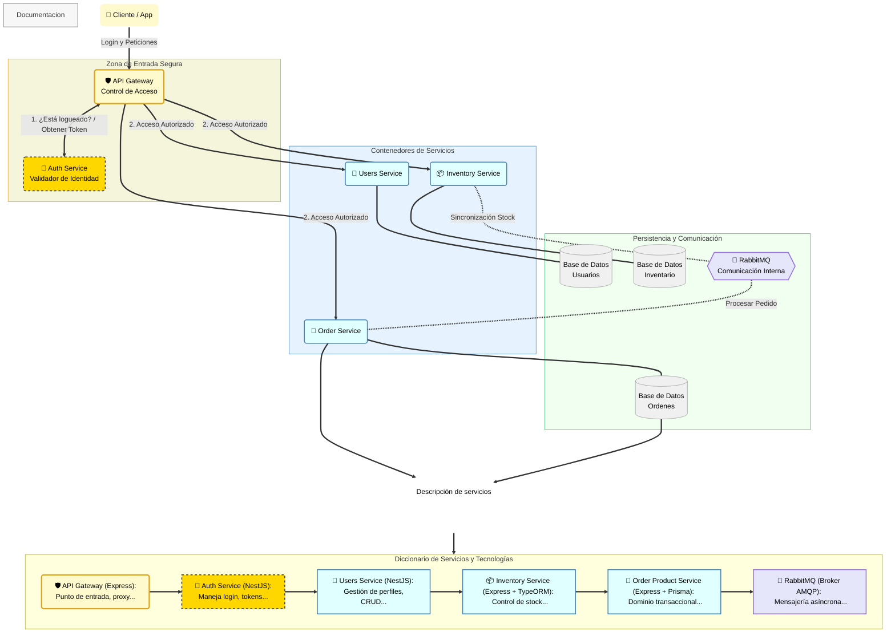

```mermaid
graph TD
    %% --- ESTILOS VISUALES (Colores y formas) ---
    %% Usamos los estilos que ya definiste
    classDef cliente fill:#FFFACD,stroke:#fff,stroke-width:2px,rx:10,ry:10,color:#000;
    classDef gateway fill:#FFFACD,stroke:#DAA520,stroke-width:3px,rx:5,ry:5,color:#000;
    classDef auth fill:#FFD700,stroke:#333,stroke-width:2px,stroke-dasharray: 5 5,color:#000;
    classDef servicio fill:#E0FFFF,stroke:#4682B4,stroke-width:2px,color:#000;
    classDef db fill:#F0F0F0,stroke:#999,stroke-width:1px,color:#000;
    classDef msg fill:#E6E6FA,stroke:#9370DB,stroke-width:2px,color:#000;
    
    %% Estilos para los subgraphs (mejor definidos fuera de classDef)
    style Entrada fill:#F5F5DC,stroke:#DAA520; 
    style Negocio fill:#E6F3FF,stroke:#4682B4; 
    style Datos fill:#F0FFF0,stroke:#3CB371; 
    style Documentacion fill:#F7F7F7,stroke:#666; 

    %% =========================================================
    %% ============= 1. DIAGRAMA DE ARQUITECTURA (TD) ==========
    %% =========================================================

    %% --- CAPA DE CLIENTE ---
    User(👤 Cliente / App):::cliente

    %% --- CAPA DE ENTRADA Y SEGURIDAD ---
    subgraph Entrada [Zona de Entrada Segura]
        direction TB
        GW(🛡️ API Gateway<br/>Control de Acceso):::gateway
        AuthService(🔐 Auth Service<br/>Validador de Identidad):::auth
        GW <-->|1. ¿Está logueado? / Obtener Token| AuthService
        linkStyle 0 stroke-width:3px;
    end
    User -->|Login y Peticiones| GW
    linkStyle 1 stroke-width:3px;
    
    %% --- CAPA DE NEGOCIO (Microservicios) ---
    subgraph Negocio [Contenedores de Servicios]
        direction LR %% Mantiene los servicios horizontales
        UserService(👥 Users Service):::servicio
        InvService(📦 Inventory Service):::servicio
        OrderService(🛒 Order Service):::servicio
    end
    
    GW -->|2. Acceso Autorizado| UserService
    GW -->|2. Acceso Autorizado| InvService
    GW -->|2. Acceso Autorizado| OrderService
    linkStyle 2 stroke-width:3px;
    linkStyle 3 stroke-width:3px;
    linkStyle 4 stroke-width:3px;


    %% --- CAPA DE DATOS Y MENSAJERIA ---
    subgraph Datos [Persistencia y Comunicación]
        direction LR %% Mantiene los DBs y RabbitMQ horizontales
        DB_Users[(Base de Datos<br/>Usuarios)]:::db
        DB_Inv[(Base de Datos<br/>Inventario)]:::db
        DB_Order[(Base de Datos<br/>Ordenes)]:::db
        Rabbit{{🐰 RabbitMQ<br/>Comunicación Interna}}:::msg
    end
    
    UserService --- DB_Users
    InvService --- DB_Inv
    OrderService --- DB_Order
    linkStyle 5 stroke-width:3px;
    linkStyle 6 stroke-width:3px;
    linkStyle 7 stroke-width:3px;
    
    InvService -.- |Sincronización Stock| Rabbit
    Rabbit -.- |Procesar Pedido| OrderService
    linkStyle 8 stroke-width:3px;
    linkStyle 9 stroke-width:3px;
    
    %% NODO SEPARADOR INVISIBLE
    FIN_ARQUITECTURA((Descripción de servicios))
    style FIN_ARQUITECTURA fill:#fff, stroke:#fff, color:#000


    OrderService --> FIN_ARQUITECTURA
    DB_Order --> FIN_ARQUITECTURA
    linkStyle 10 stroke-width:3px;
    linkStyle 11 stroke-width:3px;
    
    FIN_ARQUITECTURA --> DOCUMENTACION
    linkStyle 12 stroke-width:3px;

    %% =========================================================
    %% ============= 2. DICCIONARIO DE SERVICIOS (LR) ==========
    %% =========================================================

    subgraph DOCUMENTACION [Diccionario de Servicios y Tecnologías]
        direction LR %% El diccionario se dibuja horizontalmente
        
        D_GW["🛡️ API Gateway (Express): <br/> Punto de entrada, proxy..."]:::gateway
        D_Auth["🔐 Auth Service (NestJS): <br/> Maneja login, tokens..."]:::auth
        D_Users["👥 Users Service (NestJS): <br/> Gestión de perfiles, CRUD..."]:::servicio
        D_Inv["📦 Inventory Service (Express + TypeORM): <br/> Control de stock..."]:::servicio
        D_Order["🛒 Order Product Service (Express + Prisma): <br/> Dominio transaccional..."]:::servicio
        D_Rabbit["🐰 RabbitMQ (Broker AMQP): <br/> Mensajería asíncrona..."]:::msg
        
        %% Conexiones internas para forzar el orden (horizontal)
        D_GW --> D_Auth
        D_Auth --> D_Users
        D_Users --> D_Inv
        D_Inv --> D_Order
        D_Order --> D_Rabbit
        linkStyle 13 stroke-width:3px;
        linkStyle 14 stroke-width:3px;
        linkStyle 15 stroke-width:3px;
        linkStyle 16 stroke-width:3px;
        linkStyle 17 stroke-width:3px;
        
    end
```